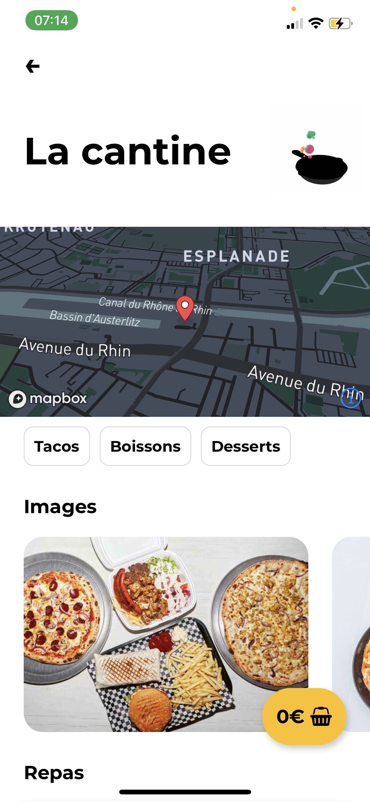
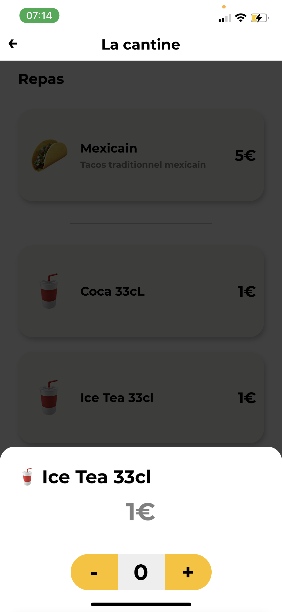

# But de l'application

Goodfood est une application qui a été devéloppée dans le cadre d'un projet scolaire au CESI en 2021. C'est une application type Uber Eat où les clients peuvent passer commande directement depuis leurs téléphones (la livraison par les coursiers n'a pas été implemamtée car en dehors du projet, j'ai cependant entamé sa réalisation par pure curiosité).

## Voici quelques screenshot de cette dernière:

### Authentification :

  
   

### Présentation des restaurations :

  
  

### Commande :

  
   

### Panier :

   
  
  

### Facture :

   

